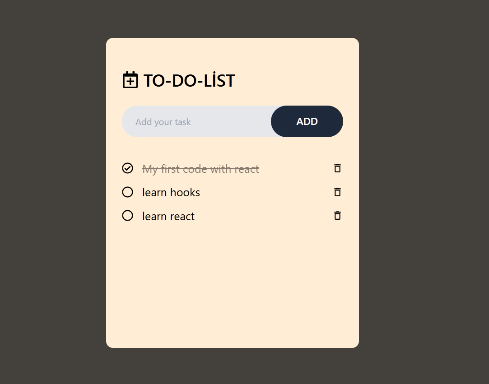
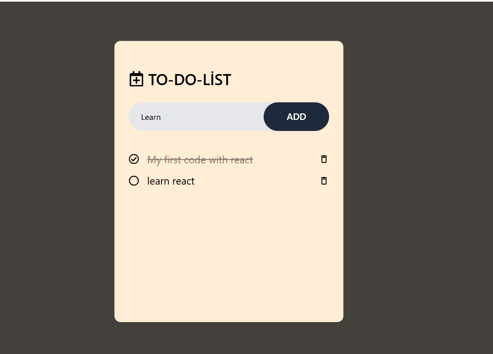

# Todo Uygulaması

Bu, React, Vite ve TailwindCSS kullanarak yapılmış basit bir Todo List uygulamasıdır. Kullanıcılar görevlerini ekleyebilir, tamamlanmış olarak işaretleyebilir ve silebilirler. Uygulama, görevleri tarayıcının `localStorage` alanında saklar.

## Özellikler

- Görevler Todo listesine eklenebilir.
- Görevler tamamlandı olarak işaretlenebilir veya tamamlanmamış olarak kalabilir.
- Görevler silinebilir.
- Görevler, tarayıcının `localStorage` alanında kalıcı olarak saklanır.

## Kullanılan Hook'lar

- **`useState`**: Todo listesi (`todoList`) ve görevlerin tamamlanma durumu (`isComplete`) gibi durumları yönetmek için kullanıldı.
- **`useEffect`**: `todoList` her değiştiğinde, bu listeyi `localStorage` ile senkronize etmek için kullanıldı.
- **`useRef`**: Yeni görevler eklemek için kullanılan input alanını referans almak ve ekleme işleminden sonra input alanını temizlemek için kullanıldı.
- 
### `classnames` Kütüphanesi

Bu projede, dinamik CSS sınıf yönetimi için `classnames` kütüphanesi kullanılmıştır. `classnames`, koşullu olarak sınıfları ekleyip çıkarmamızı sağlar, böylece kod daha okunabilir ve yönetilebilir hale gelir. Özellikle, bir öğe tamamlandığında (isComplete), üzerine `line-through` ve `opacity-50` gibi sınıfların eklenmesi sağlanır. Bu sayede stil değişiklikleri daha verimli bir şekilde yapılır.

## Kullanılan İkonlar

- **`FaRegCheckCircle`** ve **`FaRegCircle`** (`react-icons/fa`): Görevlerin tamamlanmış veya tamamlanmamış durumlarını göstermek için kullanıldı.
- **`MdOutlineDeleteOutline`** (`react-icons/md`): Görevleri silmek için kullanılan buton için kullanıldı.
- **`FaRegCalendarPlus`** (`react-icons/fa`): Başlık kısmında kullanılan bir ikon.

## Projeyi Çalıştırma

